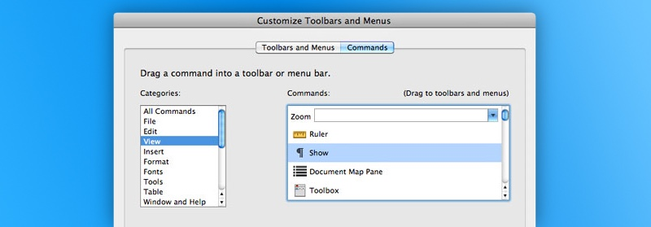

Since the early days of GUI desktop computing, customizable user interfaces have been a staple in productivity software across all major platforms. Dedicated users often spend hours on end swapping panel configurations and rearranging toolbars and buttons. Arguably, the heterogenous nature of user expectations raises the challenge of designing an interface that works for everybody. But is customization the only viable answer?

A customizable interface is one that gives the user partial or total control over one or several of its properties. For years, Microsoft Word has allowed users to customize the default toolbar under the assumption that this would help them tailor the interface to fit their unique workflows.

 _Word 2011 customization panel._

Similarly, Mac OS 10.0 has introduced customizable toolbars in some of its flagship applications. Icons can be selectively displayed, rearranged, or completely discarded in favor of text-only labels.

 _Finder customizable toolbar_

Other notable software vendors such as Macromedia and Adobe have pushed for customization in their interfaces, propelling it to a de facto standard in modern application design over the years.

Since the dawn of graphical user interfaces, academics have thoroughly studied subjectivity and efficiency in interface design ([Tullis], 1984). Most findings boil down to the following conclusion: *interfaces that accommodate subjectivity do not maximize efficiency*.

This may sound incompatible with the mantra that customization leads to more productivity, but not if you consider the following angles:

* Most users are not aware of what works best for them. Their personalization choices are more often than not based on tastes and vague assumptions.

* Learning the customization features and exploring all the possibilities before making a choice will most likely distract users from the task at hand.

* Customizable interfaces add an extra layer of complexity that may turn off less experienced users. For instance, complaints of "disappearing" toolbar buttons are not hard to come by in less computer-savvy circles.

* The efficiency of customizable interfaces may be difficult to assess using quantitative methods.

In some particular circumstances, giving users control over some elements of the interface is inevitable. But in the majority of cases, customization should be kept to a bare minimum; it's the role of product designers to figure out what works best for the majority of their users. A highly customizable interface is a clear symptom of indecisiveness and lack of understanding.

A relevant and timely example would be distraction-free writing environments on Mac OS X. Using minimalistic, barely customizable interfaces, this niche category of applications tries to address the problem of feature creep that most modern word processing solutions suffer from. Ironically, most of these application developers fail to realize that even the slightest level of customization can undermine their selling point. Distraction slowly creeps in when users are given the ability to customize fonts, colors, and backgrounds.

The recently released iA Writer for Mac trod the path of *zero customizability* in a bold move that goes against this trend. Unsurprisingly, it takes only a couple of minutes on iA Writer to realize that the lack of customization is nowhere near detrimental to efficiency. From typography to colors, everything has been taken care of for users, allowing them to fully concentrate on the task at hand: writing.

The one-size-fits-all approach could be easily dismissed as limiting for more complex software products such as graphic editors and word processors. Their thoroughly customizable interfaces are built on the premise that users have esoteric expectations and disparate workflows. Then again, one can wonder if these monolithic, can-do-it-all applications are the right answer to productivity and efficiency.

[Tullis]: http://scholarship.rice.edu/handle/1911/15866
*[GUI]: Graphical User Interface
