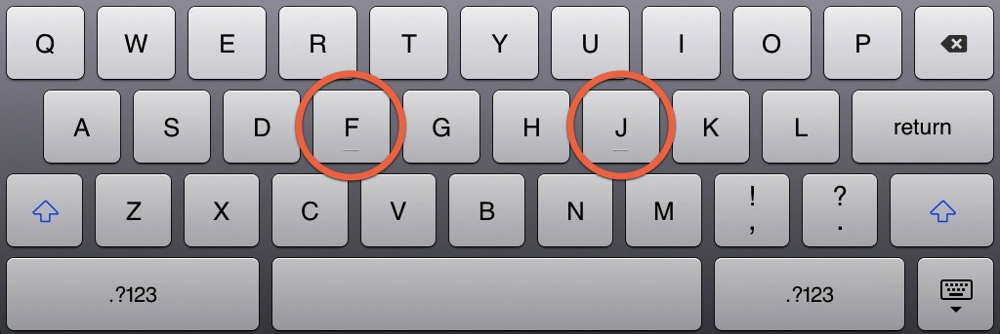
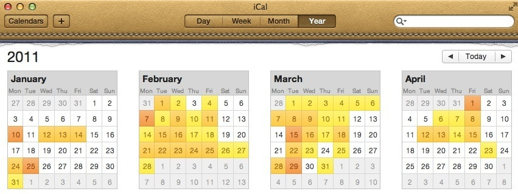
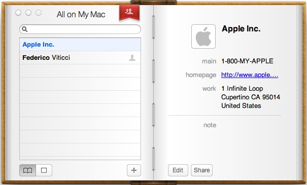

Skeuomorphs in UI design refer to interface elements that retain obsolete visual or behavioral aspects of the physical objects they are based on. For instance, the visual bumps in the `F` and `J` keys on the iPad virtual keyboard serve no functional purpose; They are mere artifacts of physical keyboards where similar indentations help provide sensory feedback to touch-typists.

 _The iPad keyboard on iOS 6._

Skeuomorphism is [not new][quicktime] at Apple; They have, on multiple occasions, shipped user interfaces that heavily borrowed from the physical objects they are based on. The most recent episode involves the redesigned iCal and Address Book in Lion, sporting a new skeuomorphic look similar to their iPad counterparts---Calendar and Contacts.

 _iCal interface in OS X Lion_

The iOS-inspired interface came under harsh criticism, dismissed as an [unnecessary gimmick][macworld] and mocked for being [hideous][kensegall] and [infantile][cushley]. While these reactions might be disproportionate, they are not completely unfounded, as skeuomorphs come with their fair share of drawbacks:

- *False affordance* leads users to expect the skeuomorph to mimic the behavior of the original object in a particular situation. Failure to meet these expectations often results in frustration and discomfort. For instance, the user might expect to be able to browse contacts by flipping the pages in the new Address Book app, even though such interaction wasn't implemented.

- *Visual noise* distracts users and negatively affect their productivity. Skeuomorphs are greedy for both screen real-estate and users' attention, on the expense of efficiency and usability. The stitches in the iCal navigation bar illustrate this point.

- *Functional limitations* dictated by the original object may severely harm the user experience. The lack of a convenient three-pane view in the new Address Book is a perfect example.

- *Disorienting* users as a result of using an alien language that does not take advantage of the experience acquired through prior interactions with standard interfaces.

- *Alienating* users with an excessive emphasis on aesthetics.

 _Address Book in OS X Lion_

When all is said and done, skeuomorphic interfaces come with some perks. Their playfulness may have a more powerful *emotional impact* on users; a contact management app that looks like an actual address book has more chances of establishing an emotional bond with its users and engaging them on the long run. Its distinctive personality might not always favor productivity, but that would be perfectly okay for the average user. The very tone of Apple's marketing is primarily emotional, and the skeuomorphic interfaces on both on iOS and on OS X perfectly serve their agenda.

[quicktime]: http://hallofshame.gp.co.at/qtimeno.htm
[macworld]: http://www.macworld.com/article/161026/2011/07/osx_lion_review.htm
[kensegall]: http://kensegall.com/2011/07/lions-little-lapse/
[cushley]: https://web.archive.org/web/20110712034954/http://cushley.net/2011/07/in-depth-os-x-lion-review-part-3-new-visual-changes/

*[UI]: User Interface
