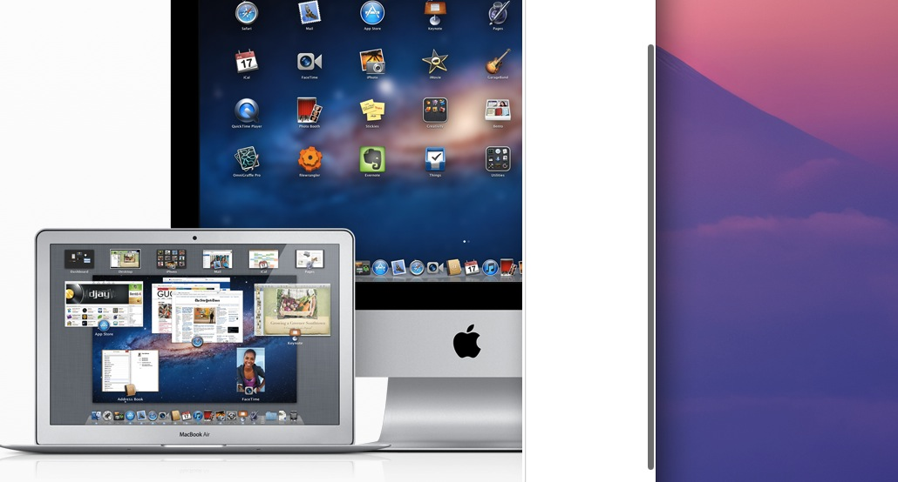

Much like the [skeuomorph controversy](), the iOS-inspired scrollbars in OS X Lion have been the topic of a heated debate in the Apple community. They have been [accused][siracusa] of causing a usability handicap by removing key information about the current state of the interface.

 _Scrollbars in Lion_

Scrollbars are first and foremost *controls*; they receive user input and instruct the view to move content accordingly. They also happen to visually inform users about the position of the visible area and how much of the overall content it covers. In his lengthy Lion [review][siracusa], Siracusa argues that Apple had to sacrifice the convenience of constantly displaying the foregoing visual cues for the sake of simplifying the interface and saving screen real estate.

Like any design decision, Apple had to make a compromise. They based their decision on the premise that in most cases, the scrollbars are not likely to be in the user's [locus of attention][locus][^1]. Using screen real-estate to display non-critical information is nothing short of a hindrance and is against the [progressive disclosure] principle.

The ensuing disappearance of any visual cues that hint at the presence of more content below the fold is also a false alarm. Getting immediate feedback from the content view is just one gesture away, and the carefully crafted bounce animations make the interface even more responsive.

Users who relied heavily on scrollbars in Snow Leopard might be disoriented at first, but that is little to pay for an improved experience on the long run.

[^1]: Raskin, 2000.

[siracusa]: http://arstechnica.com/apple/2011/07/mac-os-x-10-7/3/#scroll-bars
[locus]: http://www.usabilityfirst.com/glossary/locus-of-attention/
[progressive disclosure]: http://en.wikipedia.org/wiki/Progressive_disclosure]
