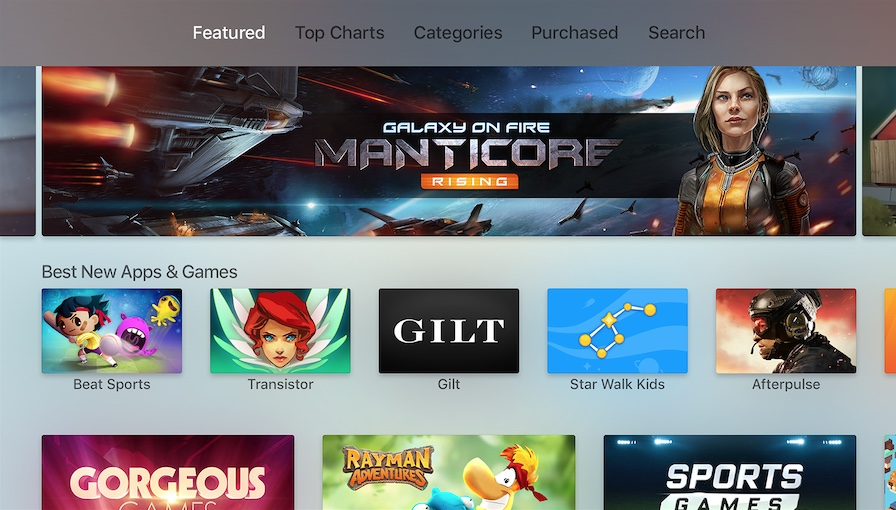

I often joke about the [HIG] being an acronym for *Highly Ignored Guidelines*.
This is an effort to change that, at least for tvOS.

 _The user interface of tvOS._

## Glossary

- **Click**. One-finger quick press on the center of the touch surface. The primary way of triggering actions.

- **Click-and-hold**. One-finger long press on the center of the touch surface. Used to trigger context-specific actions, like entering edit mode.

- **Focus**. The state of the currently selected interface element.

- **Parallax**. An effect applied to focused app icons and content elements using multiple layered images.

- **Siri Remote**. The Siri-enabled remote used as the primary input method for Apple TV. It comes with 6 buttons, a touch surface, an accelerometer, and a gyroscope.

- **Swipe**. One-finger press followed by a quick movement in any direction on the touch surface. Used to move focus vertically or horizontally.

- **Tap**. One-finger quick press on one of the four directions (top, right, bottom, left) of the touch surface. Used for single-item directional navigation.

- **Top Shelf**. The area above the first row of apps where featured content of the focused app appears.

*Update*: My colleague [Jack Nutting] pointed out that clicks require you to press the touch surface until it clicks, whereas taps don't.

## General

- Design with multiple simultaneous users in mind.
- Prefer showing old data to no data at all.
- Avoid excessive animation.
- Avoid using alerts unless it’s for a critical user decision. When you do, provide no more than two choices.
- Don’t display your logo throughout the app UI.
- Use the system video player to get advantage of all its interactive features.

## Focus

- Make focus obvious using labels, transforms, and other effects.
- Use parallax on focused elements to make the UI more responsive to user interaction.
- Prefer light backgrounds so that focus shadows remain visible.

## Controls

- Keep the difference between click and tap in mind. See the [glossary](#glossary).
- Avoid using taps for triggering actions other than navigation.
- Avoid using standard gestures to perform non-standard actions.
- Avoid defining new gestures to perform standard actions.
- Make sure your controller-compatible game works with the remote as well.
- Always enable the Play/Pause button on the Siri Remote. If you are running out of ideas, make it at least perform a click.
- Use gestures to move focus, not content. For instance, a left swipe would move focus to the left, making the content move to the right.
- Use gestures to move content when displayed full-screen. For instance. a left swipe on a full-screen image would move the image to the left.

## Navigation

- Use the tab bar for the main navigation of your app.
- Allow your users to navigate back to the previous screen or out of your app/game using the Menu button.
- Don't display a back button.
- Keep your content structure simple for easier navigation.
- Prefer text, more specifically nouns and verbs for your tab titles.

## Visual Design

- Design your interface for a 1920 x 1080 pixels (16:9) screen in mind.
- Use @1x resolution for all image assets.
- Use an opaque background layer when making your layered images.
- Provide at least one static Top Shelf image (1920px by 720px) if you don’t have any dynamic content to showcase.
- Use the sRGB color space.
- Favor muted color for better results on highly saturated TVs.
- Prefer top-to-bottom, light-to-dark gradients.
- Prefer horizontal layouts.
- Leave 60 pixels on the top and bottom, and 90 pixels on the right and left as padding around the edges of the screen.

## Text

- Use San Francisco Text for text 39 points or smaller, and San Francisco Display for text that's 40 points or larger.
- Put text in the top-most layer of your layered images.
- Use the built-in text styles to take advantage of features like Dynamic Type.
- Use title-case in your text buttons.
- Avoid combining both icons and text in buttons.
- Try to limit text-input in your app since typing on the Apple TV can be tedious.

## App Icon

- Use a layered image (2-5 layers) for your app icon (1280px by 768px for large version and 400px by 240px for the small one).
- Leave a padding around the content of your foreground layers.
- Don’t include screenshots in your app icon.
- Avoid text in your app icon, unless it’s part of the brand.

*[HIG]: Human Interface Guidelines

[HIG]: https://developer.apple.com/tvos/human-interface-guidelines/
[Jack Nutting]: https://twitter.com/jacknutting
